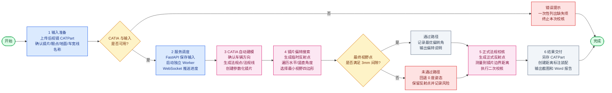

# 后视镜法规校核功能流程图（讲解版）

> 用于汇报讲解：保留主线、关键判断和交付物，弱化内部实现细节。

## 讲解顺序

1. 先讲输入：用户只需要准备 CATPart 和几个标准特征名称。
2. 再讲系统调度：Web 只负责交互，真正的 CATIA 操作放到独立 Worker，避免服务崩溃。
3. 重点讲算法：自动构造法规区域，再搜索镜片偏转角，让反射点尽量满足 3mm 间隙。
4. 最后讲交付：输出结果模型、标注装配、截图、Word 报告和偏转结论。
