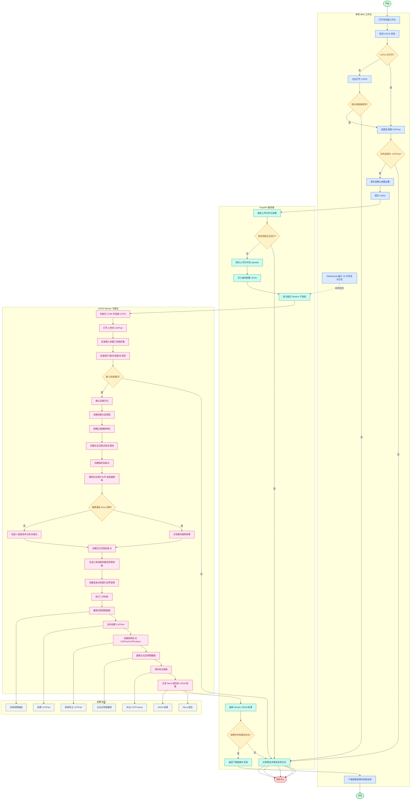

# 后视镜法规校核功能流程图

> 基于 `rearview_mirror/后视镜项目开发文档.md` 的当前真实实现整理。

## 流程说明

1. 前端先完成 CATIA 状态检测、文件类型校验和参数提交。
2. FastAPI 服务端负责上传落盘、运行锁控制、临时配置写入和 Worker 子进程启动。
3. Worker 通过 Windows COM 驱动 CATIA，完成几何构造、镜片偏转搜索、反射点创建、间隙校核、标注截图和报告生成。
4. 结果包括校核 CATPart、距离标注 CATPart、标注 CATProduct、截图、Word 报告和 JSON 结果。
5. 任一关键输入、CATIA 连接、运行锁或产物检查失败，都会进入失败日志并终止流程。
