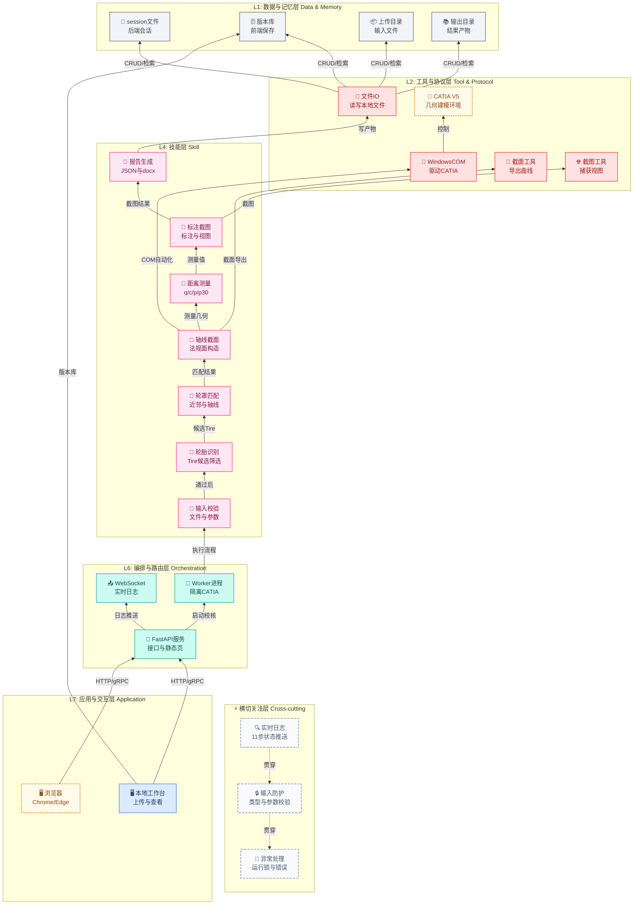

%% 📌 轮罩法规校核 智能体架构图
%% 版本: v1.0 | 日期: 2026-07-28
%% 作者: Claude Code | 状态: ✅ 已发布
%% 技术栈: 本地 Web + FastAPI + WebSocket + Python Worker + CATIA V5 COM
%% 分层: 7+1（含技能层）



## 架构图文字预览
```
  L7: 应用与交互层 Application    🖥️本地工作台 / 🖥️浏览器
  L6: 编排与路由层 Orchestration    🚪FastAPI服务 / 📤WebSocket / 🎯Worker进程
  L5: 智能体层 Agent    (此层为空)
  L4: 技能层 Skill    🎯输入校验 / 🎯轮胎识别 / 🎯轮罩匹配 / 🎯轴线截面 / 🎯距离测量 / 🎯标注截图 / 🎯报告生成
  L3: 模型层 Model / LLM    (此层为空)
  L2: 工具与协议层 Tool & Protocol    🔌文件IO / 🔗CATIA V5 / 🔌WindowsCOM / 🔌截面工具 / 🌐截图工具
  L1: 数据与记忆层 Data & Memory    💾session文件 / 🗄️版本库 / 📦上传目录 / 📚输出目录
  ⚡ 横切: 🔍实时日志 / 🔒输入防护 / 💬异常处理
```
