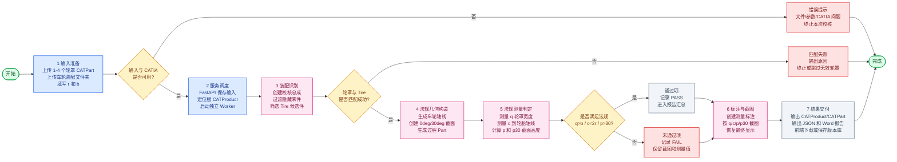

# 轮罩法规校核功能流程图（讲解版）

> 用于汇报讲解：保留主线、关键判断和交付物，弱化内部实现细节。

## 讲解顺序

1. 先讲输入：轮罩零件、车轮装配根节点、轮胎半径 r、轮胎宽度 b。
2. 再讲匹配：系统先识别 Tire 候选件，再把每个轮罩和附近车轮匹配起来。
3. 重点讲测量：围绕 q、c、p、p30 四类法规指标进行几何构造和测量。
4. 最后讲交付：输出校核总成、过程 Part、标注、截图、JSON 和 Word 报告。
