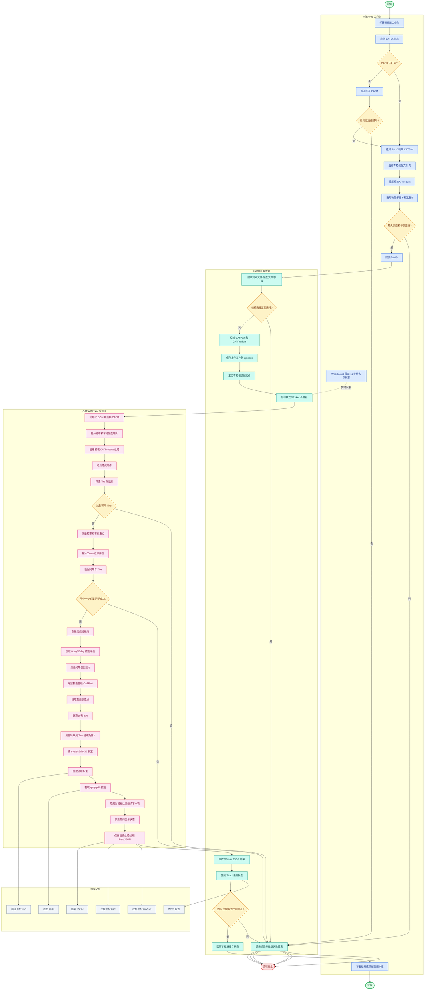

# 轮罩法规校核功能流程图

> 基于 `wheel_trim/车轮罩项目开发文档.md` 的当前真实实现整理。

## 流程说明

1. 前端负责 CATIA 状态检测、轮罩/车轮装配输入、根 CATProduct 指定、轮胎参数填写和实时日志展示。
2. FastAPI 服务端负责运行锁、文件类型校验、上传目录保存、根装配定位、Worker 子进程启动和报告生成。
3. Worker 通过 Windows COM 驱动 CATIA，完成校核总成创建、Tire 候选识别、轮罩匹配、法规轴线/截面构造、q/c/p/p30 测量、标注截图和结果保存。
4. 输出包括校核 CATProduct、过程 CATPart、标注 CATPart、截图 PNG、结果 JSON 和 Word 报告。
5. CATIA 连接失败、输入校验失败、未找到 Tire、轮罩匹配失败或结果产物缺失时，流程进入失败日志并终止。
